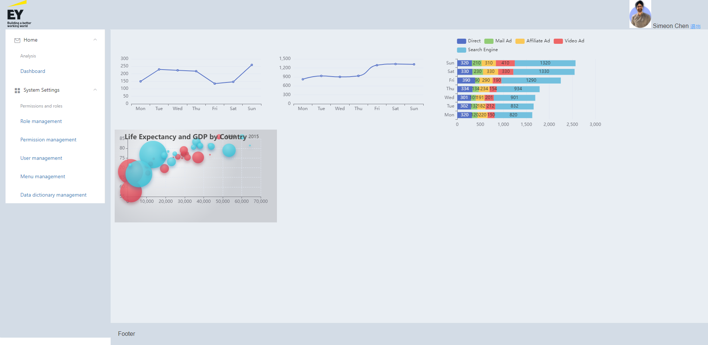

# codetest-vue2
别人改develop 
别人又改了develop 


git rebase demo - develop

这是lin

这是lin又一次更改

lin的终极更改
 
 

lin的终极更改2


lin的终极更改3 (冲突解决了3)

 
lin的终极更改2

 
 
lin的终极更改2 (冲突解决了2)

 
## Screenshots




## Project setup

```
yarn install
```

### Compiles and hot-reloads for development
```
yarn serve
```

### Compiles and minifies for production
```
yarn build
```

### Lints and fixes files
```
yarn lint
```

### Customize configuration
See [Configuration Reference](https://cli.vuejs.org/config/).
